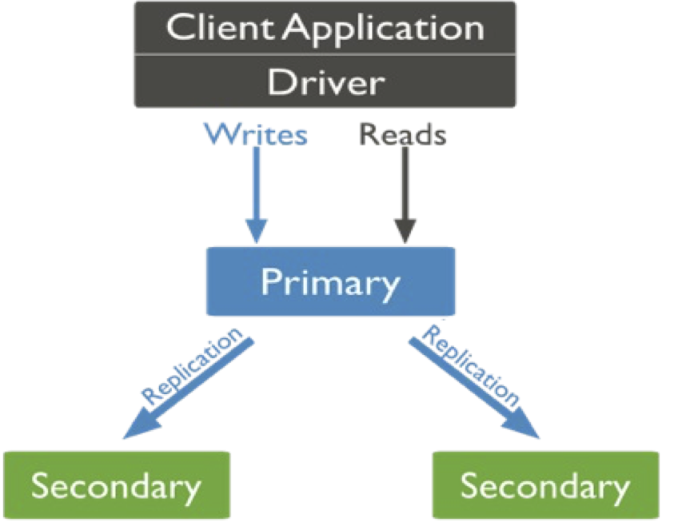

                                                                 

                                                                 
                                                                 

                                                                   
                                                                   

                                                                 
                                                                 

                                                                 
